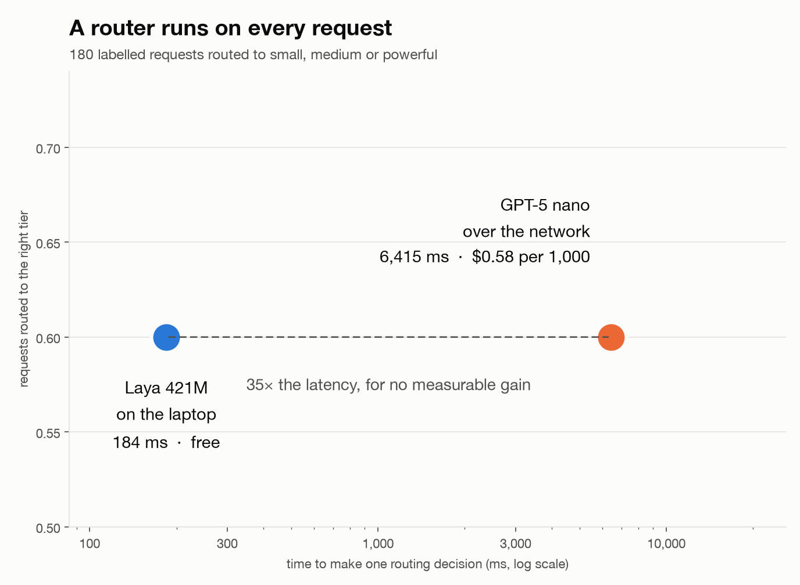

<div align="center">

<h2>Your model router runs on every request. Does it need to be a language model?</h2>

[](https://github.com/glukicov/laya_router/actions/workflows/ci.yml)
[](LICENSE)
[](.python-version)
[](https://github.com/astral-sh/uv)
[](https://github.com/astral-sh/ruff)
[](https://github.com/astral-sh/ty)
<br>
[](https://huggingface.co/convaiinnovations/laya)
[](https://platform.openai.com/docs/guides/structured-outputs)
[](https://fastapi.tiangolo.com)
[](https://kind.sigs.k8s.io)

**[Result](#result) · [Quickstart](#quickstart) · [The experiment](docs/EVAL.md) · [The data](data/README.md)**

</div>

**laya_router — a smart model router, with two brains.** Every request goes to the router first: it decides
whether a `small`, `medium` or `powerful` model should answer, then the work goes there. That decision is on
the critical path of every single request, so the router's own latency and bill are pure overhead.

Which makes routing a **System 1** job. In Daniel Kahneman's
[*Thinking, Fast and Slow*](https://en.wikipedia.org/wiki/Thinking,_Fast_and_Slow), System 1 is fast,
automatic and intuitive; System 2 is slow, deliberate and effortful. Deciding *which model should answer
this* is a reflex, not a deliberation — you want the snap judgement, and you want it before the real work
starts.

This repo puts two routers behind one endpoint and measures them on 180 labelled requests.
[**Laya**](https://huggingface.co/convaiinnovations/laya) is a 421M non-autoregressive decision model that
describes itself as a *System 1 decision engine* — its API method is literally `system_one()`. It answers
all three routing questions in **one forward pass** as probabilities, generating no text at all.
**GPT-5 nano** is the way most routers are built today: a prompt, a JSON schema, a network call — and, as a
reasoning model, a burst of System 2 deliberation on the critical path of every request.



## Result

| | route accuracy | too expensive | too weak | ECE | p50 | per 1,000 routes |
|---|---:|---:|---:|---:|---:|---:|
| **Laya 421M, local** | **0.600** | 10.6% | 29.4% | **0.093** | **184 ms** | **$0.00** |
| **GPT-5 nano** | **0.600** | 3.9% | 36.1% | 0.172 | 6,415 ms | $0.58 |

- 🤝 **The routing accuracy is a tie** — and not because they agree: they disagree on **84 of 180**
  requests, with the wins splitting 38–38 (McNemar p = 1.00). GPT-5 nano spent **252,246 output tokens**,
  ~1,400 per decision, deliberating over which of three tiers to use. Laya generated **zero**: System 2
  effort spent on a System 1 problem.
- 🪞 **They tie on the total and fail in mirror images.** Laya is a two-tier router wearing three tiers — 97%
  of `small` right, but only 7 of 56 `medium`. Nano collapses into the middle, sending **41 of 61 `powerful`
  requests to `medium`**. Its low overspend is not frugality, it is under-provisioning.
- ✍️ **Three sentences beat 35× the latency.** Rewording the tier descriptions — same model, same data —
  swings accuracy **21 points** (0.428 → 0.639). With concrete examples instead of abstract categories, the
  421M local model's macro F1 passes GPT-5 nano's, still in under 200 ms for nothing.
- 🔍 **The label audit needed auditing.** Showing a model the labels and asking if it agrees measures
  anchoring, not agreement — run it twice either side of a relabelling and the verdicts invert. Labelling
  **blind** instead puts GPT-5 at **0.817** agreement on `tier`, so the ceiling is ~0.82 and a 4-point gap
  between routers is noise.

The full study, including what it does not show, is in **[docs/EVAL.md](docs/EVAL.md)**.

## Quickstart

```bash
git clone https://github.com/glukicov/laya_router && cd laya_router
uv sync --all-extras

# Serve it. First run downloads 843 MB of weights; the model then stays resident.
uv run laya-router serve --backend laya

curl -s localhost:8000/route -H 'content-type: application/json' \
  -d '{"message":"Design a multi-region active-active architecture for our payments service."}' | python3 -m json.tool
```

Swap the brain without touching the caller:

```bash
cp .env.example .env   # add your OPENAI_API_KEY
uv run laya-router serve --backend openai
```

Reproduce the study (the OpenAI side costs about $0.10):

```bash
uv run laya-router eval run --backend laya --device mps
uv run laya-router eval run --backend openai
uv run laya-router eval report     # the comparison table
uv run laya-router eval ablate     # the wording experiment
uv run laya-router figures
```

On Kubernetes, locally:

```bash
k8s/kind/up.sh      # builds the image, creates the cluster, serves on localhost:8080
k8s/kind/down.sh
```

This is a packaging proof, not a scaling story: one replica, non-root, readiness gated on the model being
warm, weights mounted from the host cache rather than baked into the image. It earns its place for one
measurement — the same model answers in **927 ms** in the container against **184 ms** natively, because a
Linux container on macOS cannot reach Apple's MPS backend. That is a virtualisation cost, not a Kubernetes
one, and it would not appear on a Linux host. For autoscaling, GPUs and load behaviour, see
[ltm_serve](https://github.com/glukicov/ltm_serve), which is about exactly that.

## Layout

```
src/laya_router/
  questions.py     the one schema both routers answer; the OpenAI prompt and JSON schema are generated from it
  backends/        laya_backend.py (resident, one forward pass) · openai_backend.py (structured outputs)
  service.py       FastAPI: /route, /health, /questions
  evaluate.py      run a router over the labelled set · audit the gold labels with an independent model
  metrics.py       accuracy, macro F1, ECE, deferral, overspend vs underspend — dependency-free
  ablation.py      how much of a router's accuracy is really its prompt?
data/              180 labelled requests, the labelling rules, and the trap built into them
docs/EVAL.md       the experiment: every number and what it does not show
k8s/kind/          one replica, one resident model, weights mounted from the host cache
```

## Caveats

180 hand-written requests on one laptop, zero-shot on both sides, no domain calibration. An independent model
disagrees with about a quarter of the gold labels, so the ceiling is well below 1.0. The tie at 0.600 means
"no measurable difference" — the two routers actually disagree on **84 of the 180 requests**, and the 95%
interval on the paired difference is ±9.5 points. The full list is in [docs/EVAL.md](docs/EVAL.md#limitations).
