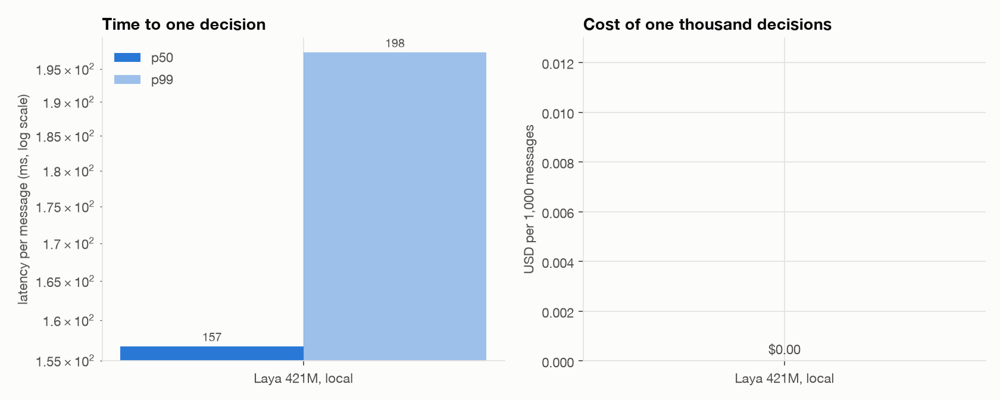
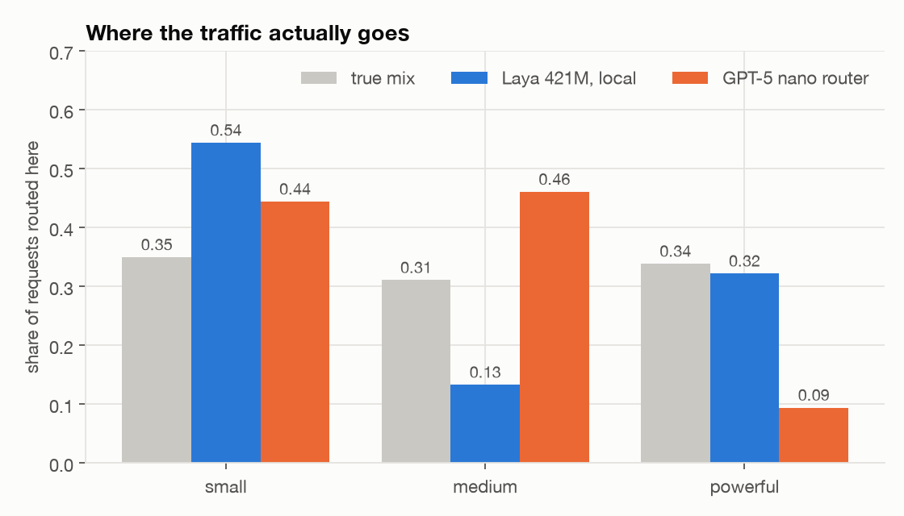
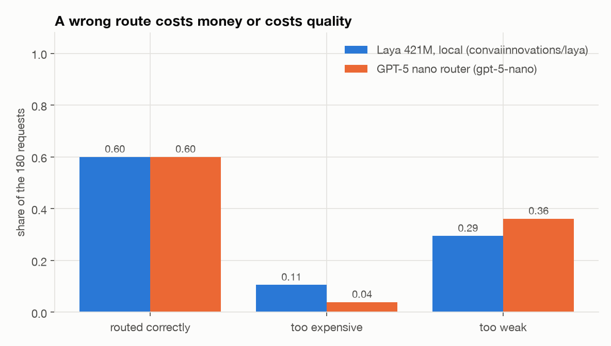
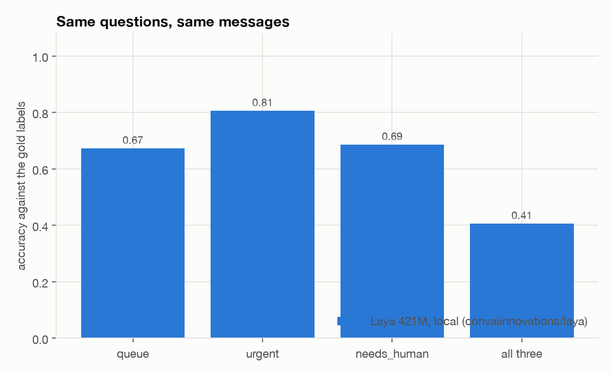
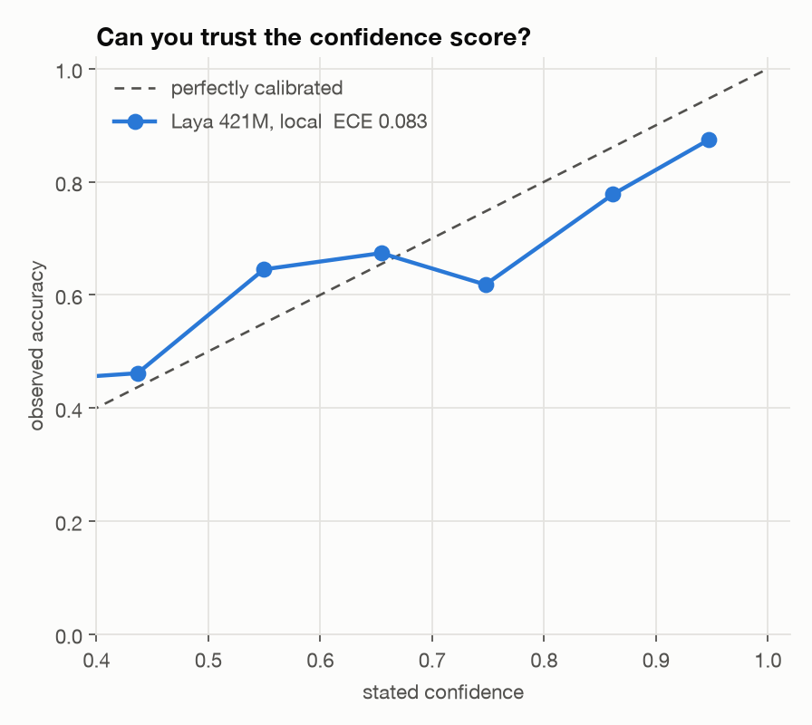
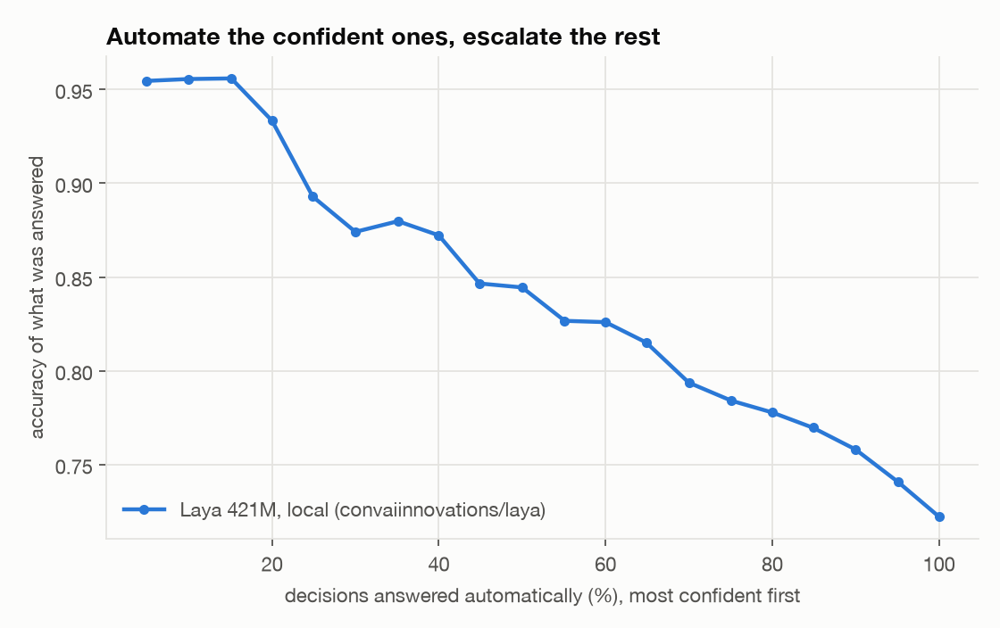
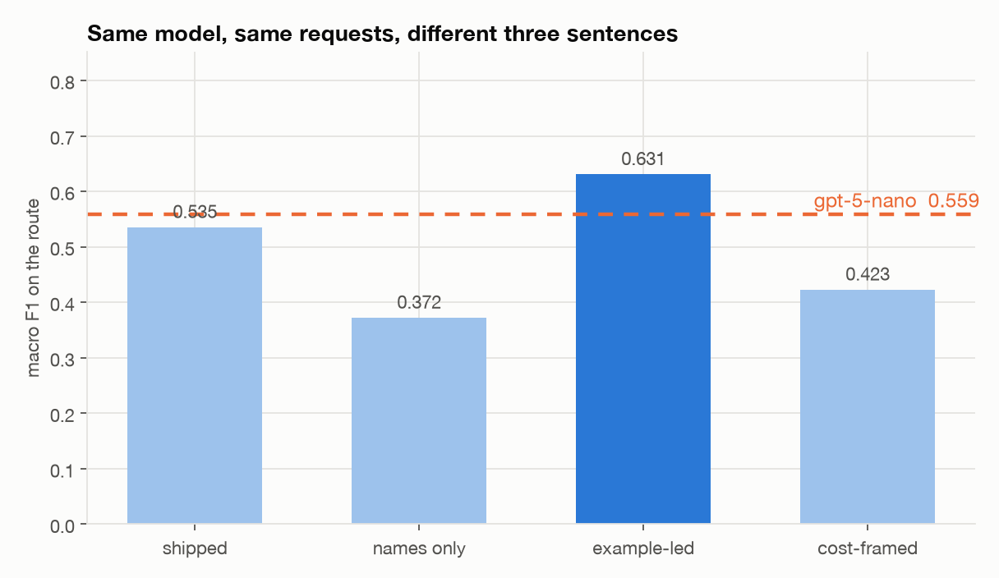

# The experiment

A router sits in front of a fleet of models and decides, per request, which tier should answer: `small` for
routine work, `medium` for general analysis, `powerful` for genuinely hard or high-stakes requests. It runs on
**every** request, so its own latency and cost are pure overhead on top of the model that does the work.

That makes routing a **System 1** job. In Kahneman's *Thinking, Fast and Slow*, System 1 is the fast,
automatic, intuitive mode and System 2 is the slow, deliberate, effortful one. "Which model should answer
this?" wants the snap judgement — and it wants it before any of the real work begins.

That is what makes a 421M encoder an interesting thing to put there — and what this experiment measures.

- **Laya.** `convaiinnovations/laya`, 421M parameters, a ModernBERT-large encoder with a typed decision head.
  The SDK describes it as a *System 1 decision engine* and the method is called `system_one()`. Not
  generative: all three questions are answered in **one forward pass** as probabilities over the options.
  No tokens produced, nothing to parse.
- **GPT-5 nano.** The same three questions, given as a prompt with a strict JSON schema, plus a request for
  its own confidence. This is how most routers are built today — and, being a reasoning model, it brings
  System 2 to the job whether or not the job wants it.
- **Same contract.** Both return the identical object (`src/laya_router/schema.py`). The OpenAI prompt and its
  JSON schema are *generated from* the question dictionary Laya consumes (`src/laya_router/questions.py`), so
  neither side is given wording the other did not.

Everything below comes from `results/`, which is committed.

## Setup

| | |
|---|---|
| Machine | Apple M4, 10 cores, 32 GB, macOS 27 |
| Laya | English root checkpoint, 512-token context, FP32 on Apple MPS, `torch.inference_mode()` |
| GPT-5 nano | `gpt-5-nano`, chat completions, strict JSON schema, default sampling |
| Dataset | 180 labelled requests, `data/requests.jsonl` ([how it was built](../data/README.md)) |
| Requests | Sent one at a time, in order, no concurrency |

Sequential on purpose: a concurrent run would measure the client's pipelining rather than time-to-one-decision,
and the two routers would stop being comparable.

## The result


| | route accuracy | macro F1 | too expensive | too weak | `needs_tools` | `is_sensitive` | ECE | p50 | p99 | per 1,000 |
|---|---:|---:|---:|---:|---:|---:|---:|---:|---:|---:|
| **Laya 421M, local** | **0.600** | 0.535 | 10.6% | 29.4% | **0.867** | 0.733 | **0.093** | **184 ms** | **233 ms** | **$0.00** |
| **GPT-5 nano** | **0.600** | 0.559 | 3.9% | 36.1% | 0.711 | **0.894** | 0.172 | 6,415 ms | 14,751 ms | $0.58 |

**The routing accuracy is a tie.** Both put 60% of the 180 requests in the right tier. The 421M model does it
in 184 ms on a laptop for nothing; the hosted model takes **6.4 seconds** and **$0.58 per thousand routes**.

### An exact tie deserves suspicion, so here is the paired breakdown

Two routers landing on precisely 108/180 looks like a copied file. It is not: they **disagree on 84 of the
180 requests**, agreeing only 53% of the time.

| | count |
|---|---:|
| both right | 70 |
| only Laya right | **38** |
| only GPT-5 nano right | **38** |
| both wrong | 34 |

The tie is an artefact of those 76 decisive cases splitting exactly evenly. If the two routers were genuinely
equally good, an exact 38–38 split happens about 9% of the time — a coincidence, not a bug, and not evidence
that they behave alike.

What the pairing does establish is that there is no difference to find here. McNemar's test on the discordant
pairs gives **p = 1.00**, and the 95% confidence interval on the paired accuracy difference is **0.0 ± 9.5
percentage points**. At n=180, any gap smaller than about 9.5 points — in either direction — is
indistinguishable from a tie. Each router's own accuracy carries its own interval too: 0.600 ± 0.072.

Read the headline as "no measurable difference in routing accuracy", never as "the same answers".

The latency is not a fluke of a slow endpoint. GPT-5 nano is a reasoning model, and it spent **252,246 output
tokens** across 180 routing decisions — about 1,400 tokens of deliberation to answer "which of these three".
Laya produced **zero**, because there is no text to produce. That is the System 1 / System 2 split showing up
as an invoice: one model reaches for an intuition, the other reasons its way to the same answer.



## They tie on the total, and fail in mirror images



| gold ↓ / routed → | small | medium | powerful | | recall |
|---|---:|---:|---:|---|---:|
| **Laya** | | | | | |
| small (63) | **61** | 1 | 1 | | 0.97 |
| medium (56) | 32 | **7** | 17 | | **0.13** |
| powerful (61) | 5 | 16 | **40** | | 0.66 |
| **GPT-5 nano** | | | | | |
| small (63) | **56** | 3 | 4 | | 0.89 |
| medium (56) | 17 | **39** | 0 | | 0.70 |
| powerful (61) | 7 | 41 | **13** | | **0.21** |

Two routers, the same score, opposite failures:

- **Laya is a two-tier router wearing three tiers.** It sends 97% of `small` work to `small` — near perfect —
  and finds two thirds of the `powerful` work. But it barely believes in the middle: it routes 13% of traffic
  to `medium` when 31% belongs there, and gets 7 of 56 right. Its mistakes split, 32 down and 17 up.
- **GPT-5 nano collapses everything into the middle.** It routes 46% of traffic to `medium` against a true 31%,
  and sends **41 of 61 `powerful` requests to `medium`**. Only 9.4% of traffic reaches `powerful`, against a
  true 34%.



This is why "too expensive" and "too weak" are reported separately. Nano's 3.9% overspend looks like the
frugal choice next to Laya's 10.6% — but it is not frugality, it is under-provisioning: nano is **too weak on
36.1%** of requests against Laya's 29.4%, and is two tiers off twice as often (6.1% vs 3.3%). A single accuracy
number hides which mistake a router prefers, and that preference is the entire design question.

## Where each one is actually better



The two yes/no questions split cleanly, and not in the direction the parameter counts suggest:

- **`needs_tools` — Laya 0.867, nano 0.711.** Whether the request needs something it does not already carry.
  Laya is 15 points better and far better calibrated (ECE 0.067 vs 0.339).
- **`is_sensitive` — nano 0.894, Laya 0.733.** Whether the subject matter carries consequences in money, law,
  health or safety. Here the big model's world knowledge earns its keep: recognising that a settlement offer
  or a warfarin interaction is high-stakes is exactly what a 421M encoder has less of.



Laya's overall ECE is **0.093** against nano's **0.172**: its probabilities mean closer to what they say. One
methodological note that mattered — Laya's SDK reports a `confidence` field for choice questions that is
*normalised entropy*, `1 − H(p)/log k`, a measure of how peaked the distribution is rather than the
probability the answer is right. Comparing that against a model's self-reported P(correct) is not
like-for-like, so this evaluation uses the probability of the chosen option instead. Using the SDK field
would have reported Laya's ECE as 0.295 rather than 0.158 on an earlier run of this task — a bug in the
harness, not in the model.



Thresholding on confidence works about equally well for both at low coverage, and better for Laya as coverage
grows: acting on the most confident 85% of decisions leaves 0.791 accuracy for Laya against 0.710 for nano.

## Three sentences are worth more than 35× the latency

The tiers are not fixed facts. They are three sentences somebody wrote. So: hold the model, the requests and
the labels fixed, change only the descriptions, and re-score (`src/laya_router/ablation.py`).



| tier wording | route accuracy | macro F1 | too expensive | too weak | share small / medium / powerful |
|---|---:|---:|---:|---:|---|
| shipped | 0.600 | 0.535 | 10.6% | 29.4% | 54% / 13% / 32% |
| names only, no descriptions | 0.428 | 0.372 | 15.0% | 42.2% | 33% / 64% / 3% |
| **example-led** | **0.639** | **0.631** | 10.6% | 25.6% | 38% / 43% / 19% |
| cost-framed | 0.439 | 0.423 | 26.7% | 29.4% | 18% / 71% / 12% |
| *GPT-5 nano, for reference* | *0.600* | *0.559* | *3.9%* | *36.1%* | *44% / 46% / 9%* |

**Rewording three sentences moves routing accuracy by 21 points** — from 0.428 to 0.639 — with the model and
the data untouched. That range is larger than the entire gap between the two routers.

Replacing abstract category descriptions with concrete example requests ("like: convert these units, fix this
typo") takes Laya's macro F1 from 0.535 to **0.631**, past GPT-5 nano's 0.559, while still answering in under
200 ms for nothing. Framing the tiers by cost rather than capability was the second-worst option tested: told
that `powerful` costs a hundred times `small`, the model stopped using it and piled 71% of traffic into
`medium`.

**The honest caveat.** These variants are scored on the same 180 requests that suggested them, so
`example-led` beating nano is a sensitivity result, not a validated improvement — you would need a held-out
set to claim the latter. What *is* robust is the spread: most of the published difference between two routers
on a task like this can be prose.

## Auditing the gold labels (and the audit)

The labels were written by one person, the weakest part of any hand-built set. So they were checked against
GPT-5 — a far stronger, independent model. Getting that check right took two attempts, and the failed one is
worth reporting.

### The first design was wrong

The first version showed GPT-5 each request **together with the proposed labels** and asked whether it agreed.
It upheld 138 of 180 and objected to 42. One objection was a fair cop: I had marked "explain *this* stack
trace" and "a cover letter based on *this* CV" as needing tools, when by my own stated rule — "requires
something *outside the model*" — the material arrives with the request. The rule was ambiguous about deictic
references. I tightened the wording, relabelled all 23 affected rows across the whole set (not only the
disputed ones, which would have been cherry-picking), updated the question both routers are asked, and re-ran
everything.

Then I re-ran the audit on the corrected labels, expecting agreement to rise. It did not move: 135 of 180.
And the disputes had **inverted**. The very rows GPT-5 had told me to flip to `false` — `sml-13`, `med-02`,
`med-08`, `med-11`, `med-30` — it now insisted should be `true`.

That is not a model changing its mind on evidence. It is anchoring: shown a label and asked to judge it, it
objects at a fairly stable rate in whichever direction the label points. **An "agreement rate" measured that
way is close to meaningless**, and if I had only run it once I would have published it as validation.

### The second design: label blind, then compare

The shipped `laya-router eval adjudicate` never shows GPT-5 the gold labels. It asks it to label each request
from scratch, and agreement is computed afterwards — the ordinary way to measure inter-annotator agreement.

| | blind agreement with the gold labels |
|---|---:|
| `tier` | **0.817** |
| `needs_tools` | 0.717 |
| `is_sensitive` | **0.944** |
| all three at once | 0.572 |

Three things follow.

**The ceiling on `tier` is about 0.82, not 1.0.** A frontier model and the annotator agree on the routing tier
four times in five. Two routers scoring 0.600 therefore have real headroom — but roughly 22 points of it, not
40. A 4-point difference between them is noise against that backdrop.

**`is_sensitive` is a well-defined question and `needs_tools` is not.** 0.944 against 0.717. The tools
question survived a rewrite and still only draws three-quarters agreement, which says the ambiguity is in the
concept rather than in my prose. Its accuracy numbers should be read with that in mind.

**GPT-5 is, incidentally, a much better router than GPT-5 nano.** Labelling blind, it lands at 0.817 on `tier`
against nano's 0.600 — so the capability gap between router models is real and large. It is also the most
expensive way imaginable to make this decision: on this task nano already costs $0.58 per thousand routes at
6.4 seconds each, and GPT-5 is roughly an order of magnitude beyond that. Paying frontier prices on every
request to save money on some of them is the trade this whole exercise is about.

## Running it somewhere other than a laptop

| Where | cold load | warm-up | p50 |
|---|---:|---:|---:|
| Native, Apple MPS | 23.2 s | 0.48 s | **184 ms** |
| Native, CPU | — | — | 260 ms |
| Container on kind (Docker Desktop, 8 CPUs) | 10.5 s | 1.15 s | **927 ms** |

All three produce **identical answers** — the model is deterministic, so only the clock changes. Two things
worth knowing. The cold load is 23 seconds and must be paid once, which is why the service keeps the model
resident and reports ready only after warm-up. And a Linux container on macOS cannot reach Apple's MPS
backend, so the kind deployment is **5× slower than the native service on the same machine** — a
virtualisation cost, not a Kubernetes one. On a Linux host it would not appear.

Even at 927 ms in a container on the wrong platform, the local router is still 7× faster than the API call.

## Limitations

- **180 requests.** The 95% interval on a paired accuracy difference is ±9.5 points, so treat anything
  smaller as noise; the per-difficulty buckets (n=9 to n=118) are weaker still. The tie at 0.600 means "no
  measurable difference", not an exact equality — the two routers disagree on 84 of the 180 requests.
- **The requests are written, not collected**, by one annotator, and a strong independent model disagrees with
  about a quarter of the labels. See the audit above and [`data/README.md`](../data/README.md).
- **The tier policy is a judgement call.** "Cheapest tier that can do it well" is a policy, not a fact. This
  measures routers against a *stated* policy, which is the only thing a router can be measured against.
- **Zero-shot, both sides.** No examples, no fine-tuning, no domain temperature fitting — which Laya's model
  card explicitly asks for before operational use. Fitting it on a held-out slice would likely improve the
  calibration numbers.
- **One model per side.** `gpt-5-nano` is one point in a large space; a non-reasoning model would be much
  faster and might route differently. An earlier run of a different task with `gpt-5-mini` cost $0.90 per
  1,000 at 3.4 s per decision.
- **The adjudicator shares a lineage with the model under test.** GPT-5 labelling a task that GPT-5 nano is
  scored on is not a fully independent reader, and it will share some of nano's blind spots. A second human
  annotator would be better evidence than any model.
- **The ablation is scored on the data that generated its hypothesis**, so it measures sensitivity to wording,
  not a validated improvement.
- **Prices are a February 2026 snapshot**, overridable with `--price-in` / `--price-out`.

## Reproducing

```bash
uv sync --all-extras
uv run laya-router eval run --backend laya --device mps    # results/laya.jsonl
uv run laya-router eval run --backend openai               # results/openai.jsonl, needs OPENAI_API_KEY
uv run laya-router eval report                             # the table above + the paired breakdown
uv run laya-router figures                                 # docs/figures/*.png
uv run laya-router eval ablate --device mps                # results/ablation.json + the ablation figure
uv run laya-router eval adjudicate                         # results/adjudication.jsonl
```

The whole OpenAI side of this study cost **$0.10**.
