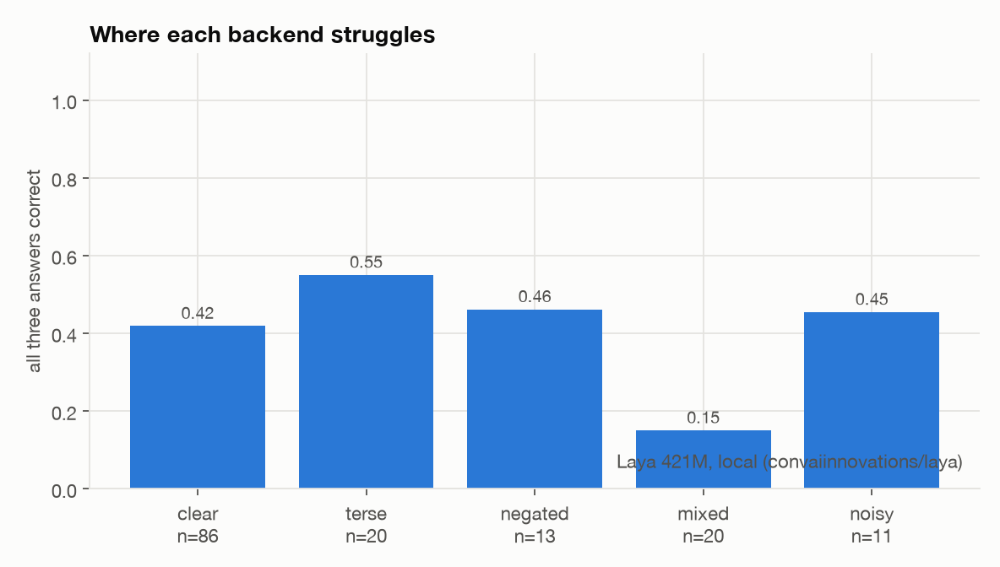

# The experiment

One triage job, answered by two very different things, scored the same way.

- **What is asked.** For each inbound support message: which of six queues owns it (`queue`), whether it is
  urgent (`urgent`), and whether a human must handle it rather than an automated reply (`needs_human`).
- **Laya.** `convaiinnovations/laya`, 421M parameters, a ModernBERT-large encoder with a typed decision head.
  It is not generative: all three questions are answered in one forward pass, as probabilities over the
  options, with no tokens produced and nothing to parse.
- **The traditional classifier.** A hosted OpenAI model given the same questions and a strict JSON schema,
  asked to fill it in and to state its own confidence.
- **Same contract.** Both return the identical object (`src/laya_router/schema.py`), and the OpenAI prompt and
  JSON schema are *generated* from the same question dictionary Laya consumes, so neither side gets wording the
  other did not (`src/laya_router/questions.py`).

Everything below comes from `results/`, which is committed. Nothing here is a vendor benchmark.

## Setup

| | |
|---|---|
| Machine | Apple M4, 10 cores, 32 GB, macOS 27 |
| Laya | `convaiinnovations/laya` (English root checkpoint, 512-token context), FP32, `torch.inference_mode()` |
| Devices measured | Apple MPS (native), CPU (native), CPU (container on kind) |
| Dataset | 150 hand-labelled messages, `data/requests.jsonl` ([how it was built](../data/README.md)) |
| Requests | Sent one at a time, in order, no concurrency |

Requests are strictly sequential on purpose. A concurrent run would measure the client's pipelining rather
than time-to-one-decision, and the two backends would stop being comparable.

## Laya: what a 421M encoder gets you

| | accuracy | macro F1 | ECE | mean stated confidence |
|---|---:|---:|---:|---:|
| `queue` (6 options) | 0.673 | 0.663 | 0.095 | 0.622 |
| `urgent` (yes/no) | 0.807 | — | 0.063 | 0.823 |
| `needs_human` (yes/no) | 0.687 | — | 0.176 | 0.841 |
| **all three correct** | **0.407** | | | |

Overall accuracy across the 450 individual decisions is **0.722**, with an overall ECE of **0.083**.


### Where it fails, and why that is the interesting part

The queue confusion matrix is not evenly spread. Laya is solid where the vocabulary is distinctive and falls
apart where the category is a matter of internal policy:

| gold ↓ / predicted → | billing | technical | sales | account | abuse | other |
|---|---:|---:|---:|---:|---:|---:|
| **billing** (30) | **26** | 1 | 2 | 0 | 0 | 1 |
| **technical** (31) | 2 | **24** | 1 | 0 | 0 | 4 |
| **sales** (24) | 2 | 2 | **10** | 0 | 0 | 10 |
| **account** (25) | 1 | 4 | 0 | **8** | 0 | 12 |
| **abuse** (20) | 1 | 1 | 0 | 1 | **15** | 2 |
| **other** (20) | 1 | 1 | 0 | 0 | 0 | **18** |

Billing, technical, abuse and other land at 80–90%. Sales (10/24) and account (8/25) collapse, and both
collapse the same way: into `other`. Laya predicts `other` for **47 of 150** messages when the true answer is
20 — over-predicting the catch-all by 2.4×.

`needs_human` is the worst-calibrated question (ECE 0.176) and the reason is not subtle: it is not a property
of the message, it is a property of *the company's escalation policy*. The gold rule here is "money moving,
legal, security, or a distressed customer" (see [`data/README.md`](../data/README.md)). A zero-shot model has
never seen that rule. It is not reading the message wrong; it is guessing a policy it was never told.



Broken down by how each message was written, the all-three-correct rate is 0.42 on `clear` messages, 0.55 on
`terse` ones — and **0.15 on the 20 `mixed` messages**, where two queues are genuinely in play. Terse beating
clear is a sample-size artefact at n=20, not a finding.

### The confidence is worth something


Laya's probabilities track the diagonal closely enough to threshold on. That matters more than the headline
accuracy, because it is what makes partial automation safe: answer the confident decisions, escalate the rest.


| answered automatically | accuracy of what was answered |
|---:|---:|
| 5% | 0.955 |
| 25% | 0.893 |
| 45% | 0.847 |
| 65% | 0.815 |
| 85% | 0.770 |
| 100% | 0.722 |

Taking the most confident quarter of decisions gets you **89% accuracy on that quarter**, against 72% if you
accept everything. The confidence score is doing real work, which is exactly what an ECE of 0.083 predicts.

### Speed, and where the container tax lands

| Where it runs | cold load | warm-up | p50 | p99 |
|---|---:|---:|---:|---:|
| Native, Apple MPS | 23.2 s | 0.48 s | **157 ms** | 198 ms |
| Native, CPU | — | — | 248 ms | 361 ms |
| Container on kind (Docker Desktop, 8 CPUs) | 12.9 s | 1.46 s | **953 ms** | — |

The three runs produce **identical answers** — this model is deterministic, so only the clock changes. Two
things are worth noting. The cold load is 23 seconds and must be paid once, which is why the service keeps the
model resident and only reports ready after warm-up. And a Linux container on macOS cannot reach Apple's MPS
backend, so the kind deployment is **6× slower than the native service on the same laptop** — not a Kubernetes
cost, a virtualisation one. On a Linux host with a GPU this gap would not exist.

Laya generated **zero output tokens** across all 150 messages. It read 41,130 input tokens and wrote nothing,
because there is no text to write.

## Does the wording of the options move the answers?

The `other` over-prediction is a hypothesis about the schema, not the model, and it is cheap to test: keep the
model, messages and labels fixed, change only how the six queues are described (`src/laya_router/ablation.py`).

| queue wording | options | macro F1 (own set) | macro F1 (same 130 messages) | answered `other` |
|---|---:|---:|---:|---:|
| shipped | 6 | 0.663 (n=150) | 0.694 | 31.3% |
| sharpened descriptions | 6 | 0.633 (n=150) | 0.662 | 30.0% |
| catch-all removed | 5 | 0.707 (n=130) | 0.707 | 0.0% |

Two results, one of them a correction to my own first reading.

**Rewriting the descriptions made it worse**, not better. Giving every queue concrete surface forms
("renewals, procurement, partnerships") and narrowing `other` to a closed list moved macro F1 *down* by 3
points and barely touched the `other` rate. Whatever is pulling sales and account into the catch-all is not
the wording.

**Removing the catch-all looks like a 4.4-point win and is not.** Dropping `other` also drops the 20 messages
it was the correct answer for — and those are not a random sample, they are messages with no clean home. Score
every variant on the 130 messages all three can answer and the gain shrinks to **1.3 points**, which at n=130
is inside the noise. The honest conclusion is the negative one: the model's difficulty separating sales and
account from a catch-all is real, and neither rewording nor removing the option fixes it.

## Auditing the gold labels

The labels were written by one person, which is the weakest part of any hand-built set. `laya-router eval
adjudicate` re-checks every one with a stronger, independent model and records the disagreements in
`results/adjudication.jsonl`, so the write-up can report how many there are rather than assert the labels are
obviously right.

## Limitations

- **150 messages.** Differences smaller than about 8 percentage points should not be read as real, and the
  per-difficulty buckets (n=11 to n=86) are smaller still.
- **The messages are written, not collected.** See [`data/README.md`](../data/README.md).
- **One machine, one checkpoint.** Apple M4, the English 421M checkpoint. The SDK also ships a multilingual
  checkpoint and a typed-decisions checkpoint fine-tuned on four synthetic workflows; neither is measured here.
- **Zero-shot, both sides.** Neither backend was given examples, fine-tuned, or had its probabilities
  temperature-fitted on this domain. Laya's model card explicitly asks for domain calibration before
  operational use, and this evaluation deliberately skips it to measure what you get out of the box.
- **The ablation is scored on the messages that generated its hypothesis**, so it measures sensitivity to
  wording, not a validated improvement.
- **Prices are a February 2026 snapshot** and are overridable with `--price-in` / `--price-out`.

## Reproducing

```bash
uv sync --all-extras
uv run laya-router eval run --backend laya --device mps     # results/laya.jsonl
uv run laya-router eval run --backend openai                # results/openai.jsonl, needs OPENAI_API_KEY
uv run laya-router eval report                              # results/metrics.json + the summary table
uv run laya-router figures                                  # docs/figures/*.png
uv run laya-router eval ablate --device mps                 # results/ablation.json
uv run laya-router eval adjudicate                          # results/adjudication.jsonl
```
